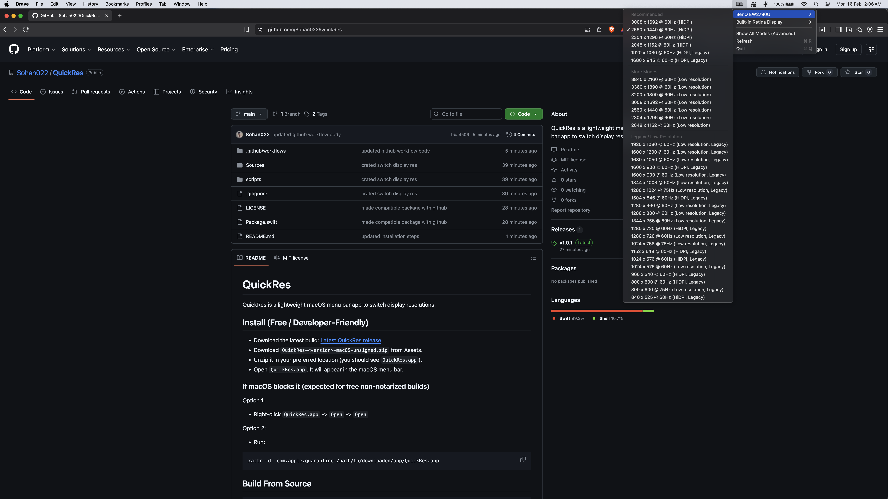

# QuickRes

QuickRes is a lightweight macOS menu bar app to switch display resolutions.

## Preview



## Install

- Download the latest build: [Latest QuickRes release](https://github.com/Sohan022/QuickRes/releases/latest)
- Download `QuickRes-<version>-macOS-unsigned.zip` from Assets.
- Unzip it in your preferred location (you should see `QuickRes.app`).
- Open `QuickRes.app`. It will appear in the macOS menu bar.

### If macOS blocks it (expected for free non-notarized builds)

Option 1:
- Right-click `QuickRes.app` -> `Open` -> `Open`.

Option 2:
- Run:
```bash
xattr -dr com.apple.quarantine /path/to/downloaded/app/QuickRes.app
```
macOS adds a quarantine tag to apps downloaded from the internet, which can block first launch.
This command removes that tag only for this QuickRes app copy so it can open.
Run this only if you trust the app source.

## Build From Source

```bash
git clone https://github.com/Sohan022/QuickRes.git
cd QuickRes
swift run QuickRes
```

After launch, click the display icon in the macOS menu bar and choose a display resolution.

Quick tips:
- Use `Pin Current Mode to Favorites` in each display submenu to add/remove favorites.
- Display titles include slot numbers like `[1]`, `[2]` used by the hotkey.

## Features

- Favorites section (pin up to 4 modes per display).
- One-click Previous Mode toggle per display.
- Global hotkey: `Ctrl + Option + Cmd + [display number]` to toggle Previous Mode.
- Shows all currently active displays (built-in + external monitors).
- Curated default list with `Recommended` and `More Modes` sections.
- Advanced toggle to show all available modes.
- Switches mode with one click from the menu bar.
- Confirms first-time switches for risky modes (legacy or low-quality options).

## Notes

- This project uses a free distribution model (ad-hoc signed, not Apple notarized).
- Available resolutions depend on your display hardware/adapter.
